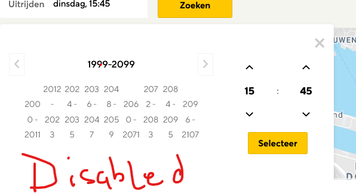

## Added awesomeness
### Add (or don't add) comments, documentation, etc.
### Apply your code style and structure the test cases.
### Report (or don't) the bugs if you spot them.
- In calendar widget, on year icon , once it displays 1999-2099 there is no way to select year
    

## Technical questions
### Import a HTML file and watch it magically convert to Markdown
###  Drag and drop images (requires your Dropbox account be linked)
###  Import and save files from GitHub, Dropbox, Google Drive and One Drive
###  Drag and drop markdown and HTML files into Dillinger
###  Export documents as Markdown, HTML and PDF
