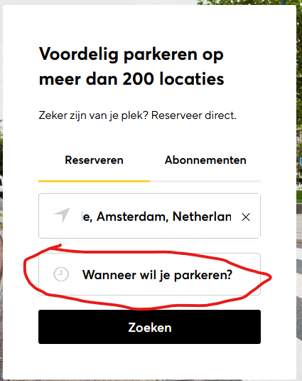
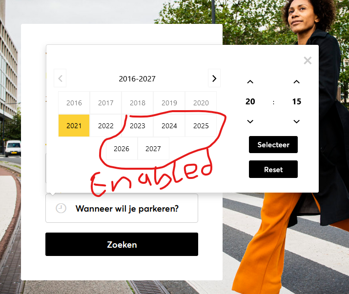
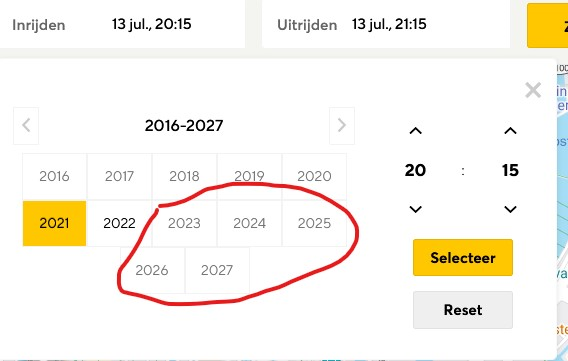

## Added awesomeness
### Add (or don't add) comments, documentation, etc.
 Refer Readme file for more details on the documentation.

### Report (or don't) the bugs if you spot them.
- In calendar widget, on year icon , once it displays 1999-2099 there is no way to select year
    
                                                                                                                                                                                                -
- search can be done without entering the date

  
-appropriate error message instead of 500 for the out  of range dates for the endpoint '<baseUrl>/garages/<garageId>/pricing/calculate'
## Technical questions
### What testing frameworks are you using currently or have worked on recently?
- Currently,I am automating testcases using cypress ,javascript, typescript
   
### What do you think of them and would you want to use them again?
- Cypress is a good framework to use for UI. All-in-one testing framework, assertion library, with mocking and stubbing etc.
In my current organization, we are using this to build regression test suit for UI.
Please read more about this at https://www.cypress.io/how-it-works
### What future or current technology do you look forward to using the most and why?
- mabl-Intelligent Test Automation tool is one of the simplest tools for software testing purpose. 
  It helps to automate web browsers like Selenium IDE and Selenium WebDriver and other such automation tools.
  This tool doesn't require any tester or developer to know to code and can write scriptless code by simply fetching data based on the user's actions performed. 
  It provide great visuals and monitors anomalies too as well.It keeps a track of network spikes and tracks performance of the platform.
Though I do not have hands on this tool, I have done quite a bit of research on it, it has got me interested.

### How would you improve the dynamic pricing functionality or API methods you were testing (bug fixes, usability suggestions, etc.)?
####API
The api to calculate pricing looks fine. Few improvements that comes to mind are as below,
- The garageId need to be added in response for calculate price api .(to ensure reliability of request and response of api)
- [feature Improvement] Add a field expiry time to the price (to offer discounted price)
- Standardise errors json object for all response code . I could have avoided below check
```
  if ("[validation_error]".equals(errorCode)) {
  errorMsg = jsonPath.getString("errors.properties.message");
  } else {
  errorMsg = jsonPath.getString("errors.errorMessage");
  }
```

####UI  
- Make date selection mandatory in reserve date selection i.e disable search button till user select time
- Display selected year on the calendar 
    
- Calendar on reserve search page user can select more than 1 year on future dates but on dynamic price it is restricted for an year.
see the below picture
  
  

### How would you improve your test suite if you had more time?
- mocking the garage test data. 
- Adding more UI testcases for different positive and negative scenarios .
- Adding specific testcases for widgets(e.g calendar) as part of bdd.

