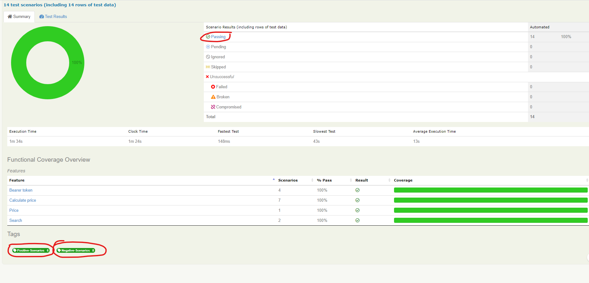
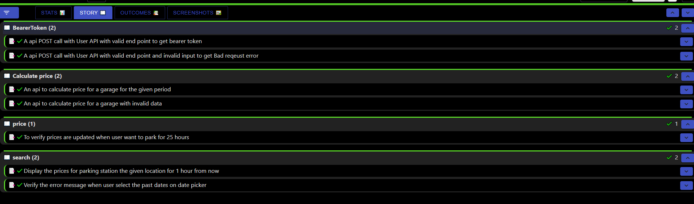
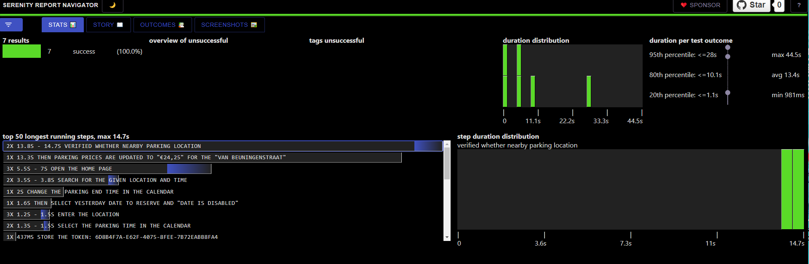

# Parkbee REST API testing with Serenity and Cucumber

## Get the code

Git:

    git clone https://github.com/bniraja/park-bee.git
   
### The project directory structure
The project has build scripts for both Maven and Gradle, and follows the standard directory structure used in most Serenity projects:
```Gherkin
src
  + main
  + test
    + java                              Test runners and supporting code
      + models                          Api response models
      + stepdefinitions                 Step definitions for features
         CucumberTestSUiteRunner        Test runner config using cucumber options
    + resources
      + features                        Feature files
          + auth
                      

```

## Write new tests
1. New Cucumber scenario can be added in '..\src\test\resources\features'
2. Step definitions can be return in '..\src\test\java\parkbee\automation\acceptance\<ui/api>\stepdefinitions'
3. Step definitions uses steps from 'xxxSteps' java classes 
 

## Test reports

You can generate full Serenity reports by running `mvn clean verify`. 

You can Find test report in location '../target/site/serenity/'

SERENITY REPORTS

Full Report: ../target/site/serenity/index.html

Single Page HTML Summary: ../target/site/serenity/serenity-summary.html

Full Report As React Based Single Page Application: ../target/site/serenity/navigator/index.html

## Building the project
mvn clean install

## Run tests locally?
Goals:
It must be “verify” 

for eg., Maven commands: mvn clean verify
with environment 
mvn clean verify -Denvironment=dev

## Living documentation
You can generate full Serenity reports by running `mvn clean verify`.
This includes both the living documentation from the feature files:




And also details of the REST requests and responses that were executed during the test:
